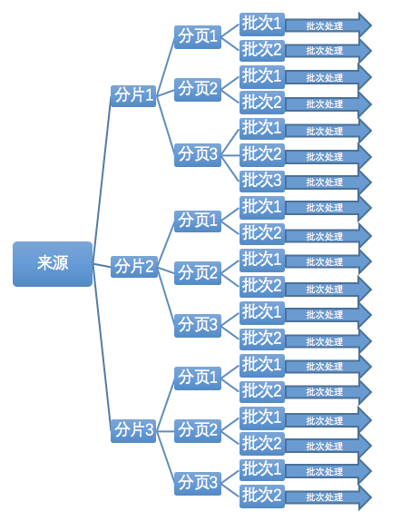
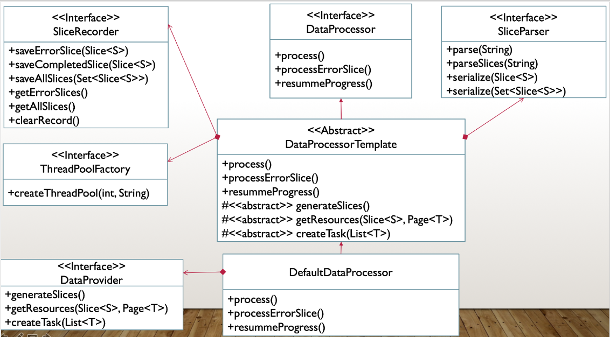

# 数据处理通用框架

数据处理通用框架，用于将大量的数据进行分片分页分批处理的通用处理框架

# 背景

随着 **系统迁移工作** 的展开，数据迁移的需求越来越多：从SqlServer迁移到Mysql，或者SqlServer/Mysql到ES

这些迁移工作都有一个共同点，就是量比较大，耗时比较长，属于IO密集型的任务，可以使用多线程提升效率。

此框架脱胎于ES数据导入任务，该任务需要将 2000 万左右的商机主体数据从数据库查出并调用其他接口查询到商机的附加字段，然后导入到ES中。

其难点在于，数据量较大，耗时较长，商机没有自增主键无法按主键进行翻页，而且时间长的情况下，如果导到一半程序挂掉，需要支持断点续传（只重新导入失败的数据）

# 解决方案：数据分片分页分批处理框架

## 用户导向

使用者只需要关注**数据从哪来，要做什么处理**，其他的事情都交给框架解决。合理的默认值设置，通常情况下不需要关心处理的细节，如果有更高要求，则可以对一些参数进行定制化的调节。

## 实现原理

框架将需要分片分页分批处理的数据的处理过程进行抽象，使用模板模式将业务无关的模板代码抽离出来，让使用者只需要关注自己的业务实现，而无需关心实现的技术细节，如线程池的创建、切片处理、分批处理、出错记录等。



每个分片做为任务条件提交到线程池进行处理，每个分片线程建立自己的线程池，以分片做为分页的依据获取来源资源，将分页数据分解成各个批次，将每批次的数据做为条件创建任务提交到分片线程中的线程池进行处理。各个批次提交完毕之后，分片线程等待任务执行完毕后再记录当前切片的处理结果。

## 核心接口 DataProcessor

本框架的核心接口 DataProcessor 展示了处理所需要的所有功能

* process 执行处理逻辑
* processErrorSlices 导入失败的分片
* resumeProgress 恢复上次未完成的任务（断点续传）

```java
public interface DataProcessor {
    /**
     * 处理数据
     */
    boolean process();
    /**
     * 导入失败的分片
     */
    boolean processErrorSlices();
    /**
     * 恢复上次未完成的任务（断点续传）
     */
    boolean resumeProgress();
}
```

# 使用方式

## 引入

```xml
<dependency>
   <groupId>com.github.dadiyang</groupId>
   <artifactId>dataprocessor</artifactId>
   <version>1.0.0</version>
</dependency>
```

使用者唯一需要关心的就是自己的业务逻辑（**数据从哪来，要做什么处理**），主要就是以下三个方法：

 * **generateSlices** 用于生成分片，以根据分片进行分批处理（**Long和Date类型分片规则已有相应的实现类**）
 
 * **getResources**   根据分片和分页条件从来源处获取需要被处理的数据（*数据从哪来*）
 
 * **createTask**     创建根据给定的分批数据进行实际处理的任务（*要到哪里去*）

根据提供以上三个方法的不同方式，有实现`DataProvider`接口和继承`DataProcessorTemplate`抽象类两种使用方式

## 方式一：实现 DataProvider 接口传给 DefaultDataProcessor 类（推荐）

DataProvider接口

```java
public interface DataProvider<T, S> {
    /**
     * 获取所有分片
     * @return 分片
     */
    Set<Slice<S>> generateSlices();
    /**
     * 从数据源获取需要被处理的资源
     * @param slice     分片
     * @param lastPage 上一页，即刚刚处理完成的这一页，如果是第一次获取则为 null
     * @return 需要被处理的资源，若hashNext()返回false则认为本批次已处理完成
     */
    Page<T> getResources(Slice<S> slice, Page<T> lastPage) throws Exception;
    /**
     * 创建实际处理逻辑的任务
     * @return 实际处理逻辑的任务，注意：Callable调用后抛出异常，则认为本批次处理失败
     */
    Callable<?> createTask(List<T> resources);
}
```

实现DataProvider接口，然后生成实现类的实例，使用该实例创建 DataProcessor 类

```java
// 创建 DataProvider 
DataProvider<Opportuntiy, Date> dataProvider = new ...；
DataProcessor<Opportuntiy, Date> processor = new DefaultDataProcessor<>(dataProvider);
// 开始处理
processor.process();
```

**注意：** 框架中提供了 `DateSliceDataProvider` 和 `LongSliceDataProvider` 两个实现 DataProvider 接口的抽象类，如果你是根据 Date 或者 Long 类型进行切片，可以选择继承一个以省去切片规则的实现。

## 方式二：继承 `DataProcessorTemplate` 抽象类

继承 `DataProcessorTemplate` 抽象类并实现 `generateSlices`、`getResources`、`createTask` 三个方法
 
使用方式与方式一类似

## 参数配置

**DefaultDataProcessor** 可以调整以下几个参数，可以调用相应的 setter 方法进行调整

* slicesThreadNum 分片线程数，即同时进行处理的分片数，默认 8
* numPerBatch     每批处理的数理，默认 1000
* launchInterval  多个分片同时启动时，每个启动之间的间隔，单位毫秒。有些查询会比较耗时，如果同时启动太多个分片，会导致数据库压力过大导致超时，建议在查询会给数据库造成压力的时候适当调整此参数，默认 3000
* retryTime 失败重试次数，默认 3
* retryNullable 被重试的方法是否可以接受null值，若不能接受，方法返回null值视为失败，会进行重试（仅对分片任务处理有效），默认 true

**注意**：这些属性的 `setter` 方法不支持运行时调用，如果你调用了` process()` 方法而且处理过程还没有结束，不允许修改这几个属性，否则会抛出 `throw new IllegalStateException("当前有任务正在执行");`

# 断点续传

如果处理途中程序挂掉，可以使用断点续传功能恢复上次的任务。其粒度为切片级别，即恢复上次任务意味着已完成的切片不再重复处理，如果是处理一半的切片会重新处理。

原理是读取上次切分的所有分片和已完成的分片，取差集进行继续处理。

## 使用方式

```java
processor.resumeProgress()
```

## 注意事项

* 断点续传依赖 SliceRecorder 类记录上次的全部切片和已完成切片，恢复时读取全部切片和已完成切片进行取差值，所以必须保证使用的是同一个 SliceRecorder。默认的SliceRecorder实现基于文件存储，必须保证调用 `resumeProgress()` 方法时，其所使用的文件在指定的位置上。
* 处理到一半的切片会重新处理，意味着你的处理逻辑必须自行解决同一条数据会被重复处理的问题

# 扩展

## SliceParser 切片解析器

用于对切片进行序列化和反序列化的工具

默认使用FastJson实现

如果有需要可以自己实现接口传给DataProcessor

## SliceRecorder 切片记录器

用于记录和读取切片，包括启动时获取到的全部切片，处理完成的切片和处理出错的切片。

默认使用本地文件进行记录，将记录写到启动目录的data文件夹下。

你可以实现自己的记录器，只需要实现该接口并传给DataProcessor就可以

## ThreadPoolFactory 线程池工厂

用于生成线程池，程序会给定一个经过计算认为合适的线程池大小，你可以根据自己的需要定制自己的实现

默认使用建议的线程池大小生成固定大小线程池，拒绝策略使用阻塞式，即当队列满时再添加任务将会被阻塞并且为每个线程命名

# 依赖

* slf4j-api 日志
* FastJson (在DefaultSliceParser中用于对分片的序列化和反序列化)

# 基本原则

最后，我想尝试以软件设计的五大基本原则在本框架中的应用，有兴趣的可以了解一下，否则可以直接跳过这一节

* 依赖反转原则

> 程序要依赖于抽象接口，不要依赖于具体实现



本框架主要由`DataProcessor、DataProvider、SliceParser、SliceRecorder、ThreadPoolFactory`五个接口组成，由这些接口相互配合实现所有的功能。

`DataProcessorTemplate`抽象类结合使用其他`SliceParser、SliceRecorder、ThreadPoolFactory`接口负责实现`DataProcessor`的通用部分功能

`DefaultDataProcessor`继承`DataProcessorTemplate`将必须实现的抽象方法委托给`DataProvider`接口。

可见类之前的交互都依赖于接口而不是具体的实现

* 单一职责原则

> 一个类，只有一个引起它变化的原因。

每个接口及其实现类都有自己单一的职责

1. `DataProcessor`: 核心接口，负责整个框架需要提供的功能
2. `DataProvider`: 用户必须实现的接口，告诉框架数据从哪里来，要到哪里去，以什么方式分片
3. `SliceParser`: 分片解析器，负责分片的序列化和反序列化
4. `SliceRecorder`: 分片记录器，负责记录所有分片、已完成分片和出错的分片
5. `ThreadPoolFactory`： 线程池工厂，负责创建线程池

* 接口隔离原则

> 不应强行要求客户端依赖于它们不用的接口；
> 
> 类之间的依赖应该建立在最小的接口上面。

框架中每个接口的职责都很单一，用户只需要关注自己需要的功能，该功能对应的接口没有要求任何与功能无关的方法

* 里式替换原则

> 继承必须确保超类所拥有的性质在子类中仍然成立。

框架中提供的所有实现类都可以替换其父类（接口）的位置

* 开放封闭原则

> 软件实体应该是可扩展，而不可修改的。也就是说，对扩展是开放的，而对修改是封闭的。

框架本身已经提供了相应接口的默认实现类和各个属性的常规情况下的默认值，如果用户有更加个性化的需求，无需修改框架本身的代码，而是实现该功能对应的接口，然后传递给主类以达到修改的目的。